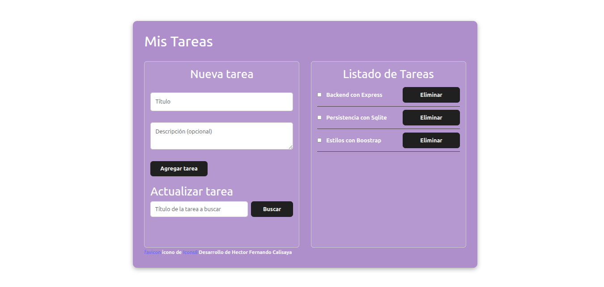

# IT Challenge Formar

- Mi proyecto consiste en una app Web para la gestion de tareas se visualisan en una sola pantalla ,pensado  para un manejo sencillo e intuitivo aunque puede agregarse mas secciones y interactividad.

## Tegnologias Aplicadas

<p align="left">
<a href="https://git-scm.com/" target="_blank" rel="noreferrer"></a><a href="https://developer.mozilla.org/en-US/docs/Web/JavaScript" target="_blank" rel="noreferrer"></a><a href="https://developer.mozilla.org/en-US/docs/Glossary/HTML5" target="_blank" rel="noreferrer"></a><a href="https://reactjs.org/" target="_blank" rel="noreferrer"></a><a href="https://www.w3.org/TR/CSS/#css" target="_blank" rel="noreferrer"></a><a href="https://getbootstrap.com/" target="_blank" rel="noreferrer"></a><a href="https://vitejs.dev/" target="_blank" rel="noreferrer"></a><a href="https://nodejs.org/en/" target="_blank" rel="noreferrer"></a><a href="https://expressjs.com/" target="_blank" rel="noreferrer"></a>
</p>


## Autor

- [@Fernando Calisaya](https://github.com/Fe25dev)


## Caracteristicas

- Diseño responsive
- Intuitivo


## Installacion

Install IT-Challenge con npm una ves descargado este repositorio ,localmente instalamos las dependencias previamente ubicandonos en la carpeta del proyecto.

```bash
  npm install 
```
luego ubicados en la carpeta correspondiente al backend abrimos consola o desde nuestro ide. 

```bash
 
  cd Backend
  npm run start
```

De manera similar una ves ubicados  en la carpeta del Frontend 

```bash
  cd Frontend
  npm run dev
```
## Gif de funcionamiento


## ScreenShot de la app



